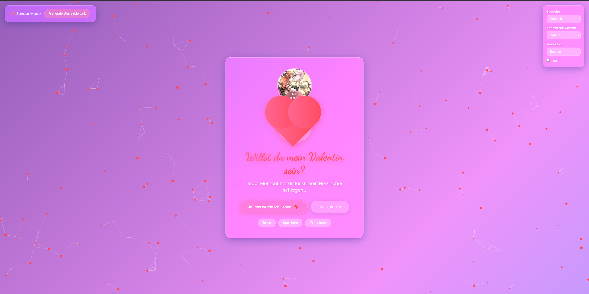

# JustBeMyValentine 💖

[](https://opensource.org/licenses/MIT)
[](https://developer.mozilla.org/en-US/docs/Web/HTML)
[](https://developer.mozilla.org/en-US/docs/Web/CSS)
[](https://developer.mozilla.org/en-US/docs/Web/JavaScript)

A beautiful, interactive Valentine's Day proposal web application featuring modern glassmorphism design, smooth animations, and delightful user interactions.

## ✨ Features

- **Glassmorphism UI Design** - Modern frosted glass aesthetic with backdrop blur effects
- **Interactive Proposal Page** - Engaging "Will You Be My Valentine?" interface with animated heart
- **Dynamic Button Interactions** - Playful "No" button that runs away on hover
- **Particle Effects** - Beautiful animated particle background using particles.js
- **Smooth Animations** - GSAP-powered transitions and celebrations
- **Romantic Poem Page** - Elegant follow-up page with floating flowers and hearts
- **Responsive Design** - Fully optimized for desktop, tablet, and mobile devices
- **Gradient Backgrounds** - Animated multi-color gradient backgrounds
- **Confetti Celebration** - Festive confetti effect upon acceptance
- **Sound Effects** - Interactive sound effects for buttons, heartbeat, and celebrations using Web Audio API
- **Multi-Language Support** - Support for 8 languages (English, Spanish, French, German, Italian, Portuguese, Japanese, Chinese)
- **Photo Upload** - Personalize your proposal by uploading a photo
- **Theme Selector** - 7 beautiful color themes (Default, Romantic, Sunset, Ocean, Forest, Purple Dream, Dark Mode)
- **Social Media Sharing** - Share your proposal on Facebook, Twitter, and WhatsApp
- **Save & Export** - Save your proposal settings and export as PNG image
- **Animation Presets** - 5 different animation styles (Default, Bounce, Float, Pulse, Rotate, Wave)

## 📸 Screenshots

### Main Proposal Page

*The beautiful glassmorphism proposal interface with animated heart and interactive buttons*

### Full Interface with Customization Options

*Complete interface showing sender mode, language selector, theme options, photo upload, and all customization features*

## 🚀 Quick Start

1. Clone the repository:
```bash
git clone https://github.com/VoxHashTechnologies/JustBeMyValentine.git
cd JustBeMyValentine
```

2. Open `index.html` in your web browser:
```bash
# On Windows
start index.html

# On macOS
open index.html

# On Linux
xdg-open index.html
```

That's it! No build process or dependencies required.

## 📦 Installation

This project requires no installation or build tools. Simply:

1. Download or clone the repository
2. Open `index.html` in any modern web browser
3. Enjoy the interactive Valentine's experience!

### Browser Requirements

- Chrome 76+ (recommended)
- Firefox 103+
- Safari 9+
- Edge 79+

All browsers must support:
- CSS `backdrop-filter` property
- ES6 JavaScript features
- CSS Grid and Flexbox

## 💻 Usage

### Basic Usage

1. Open `index.html` in your web browser
2. View the animated proposal page with glassmorphic design
3. Click "Yes, I'd love to! 💖" to accept and see the celebration
4. You'll be redirected to `poem.html` with a romantic poem

### Interactive Features

- **Heart Animation**: The heart continuously pulses with a heartbeat animation (with multiple animation presets)
- **Particle Background**: Animated particles create a romantic atmosphere
- **No Button**: Hover over the "No" button to see it playfully move away
- **Celebration**: Clicking "Yes" triggers confetti and celebration animations
- **Floating Elements**: The poem page features floating flowers and hearts
- **Sound Effects**: Interactive sounds for all interactions (toggleable)
- **Language Switching**: Change language on the fly with 8 supported languages
- **Theme Customization**: Switch between 7 beautiful color themes
- **Photo Personalization**: Upload your own photo to personalize the proposal
- **Social Sharing**: Share your proposal via Facebook, Twitter, WhatsApp, or copy link
- **Save & Export**: Save your settings and export the proposal as an image

## ⚙️ Configuration

| Component | Description | Default Value | Customizable |
|-----------|-------------|---------------|--------------|
| Particle Count | Number of particles in background | 50 | Yes (in `script.js`) |
| Particle Color | Color of particles | `#ff4757` | Yes (via Theme Selector) |
| Animation Speed | Heartbeat animation duration | 1.4s | Yes (in `style.css`) |
| Gradient Colors | Background gradient colors | Multi-color gradient | Yes (via Theme Selector) |
| Glassmorphism Blur | Backdrop blur intensity | 20px | Yes (in `style.css`) |
| Container Opacity | Glass container transparency | 0.15 | Yes (in `style.css`) |
| Language | Interface language | English | Yes (via Language Selector) |
| Theme | Color theme | Default | Yes (via Theme Selector) |
| Animation Preset | Heart animation style | Default | Yes (via Animation Selector) |
| Sound Effects | Enable/disable sounds | Enabled | Yes (via Sound Toggle) |

### Customization Examples

**Change Particle Count:**
```javascript
// In script.js, line 5
value: 50,  // Change to desired number
```

**Modify Gradient Colors:**
```css
/* In style.css, body background */
background: linear-gradient(135deg, #667eea 0%, #764ba2 25%, #f093fb 50%, #4facfe 75%, #00f2fe 100%);
```

**Adjust Glassmorphism Blur:**
```css
/* In style.css, .container */
backdrop-filter: blur(20px) saturate(180%);  /* Change 20px to desired value */
```

## 📝 Examples

### Example 1: Basic Proposal Page

The main page (`index.html`) displays:
- Animated glassmorphic container
- Pulsing heart animation
- Interactive buttons with hover effects
- Particle background

### Example 2: Poem Page

After accepting, `poem.html` shows:
- Romantic poem with elegant typography
- Floating flowers and hearts
- Glassmorphic container matching main page
- Smooth fade-in animations

### Example 3: Using New Features

**Change Language:**
- Use the language selector in the top-right controls panel
- Select from 8 supported languages
- All text will update automatically

**Switch Themes:**
- Choose from 7 beautiful themes via the theme selector
- Themes include: Default, Romantic, Sunset, Ocean, Forest, Purple Dream, Dark Mode
- Theme preference is saved automatically

**Upload Photo:**
- Click "Upload Photo" button
- Select an image file
- Your photo will appear in a circular frame above the heart

**Share Your Proposal:**
- Click the "Share" button
- Choose from Facebook, Twitter, WhatsApp, or copy link
- Share your personalized proposal with others

**Export as Image:**
- Click the "Export" button
- The proposal will be saved as a PNG image
- Perfect for sharing on social media or printing

**Change Animation:**
- Select from 5 animation presets: Default, Bounce, Float, Pulse, Rotate, Wave
- Watch the heart animation change in real-time

**Toggle Sound:**
- Enable/disable sound effects using the sound toggle
- Sound preference is saved automatically

## 🗺️ Roadmap

- [x] Add sound effects for interactions
- [x] Implement multiple language support
- [x] Add photo upload feature for personalization
- [x] Create theme selector (different color schemes)
- [x] Add social media sharing functionality
- [x] Implement save/export feature for the proposal
- [x] Add more animation presets

## 🤝 Contributing

Contributions are welcome! Please follow these steps:

1. Fork the repository
2. Create a feature branch (`git checkout -b feature/AmazingFeature`)
3. Commit your changes (`git commit -m 'Add some AmazingFeature'`)
4. Push to the branch (`git push origin feature/AmazingFeature`)
5. Open a Pull Request

### Development Guidelines

- Follow existing code style and formatting
- Test changes in multiple browsers
- Ensure responsive design is maintained
- Keep glassmorphism aesthetic consistent
- Add comments for complex logic

## 📄 License

This project is licensed under the MIT License - see the [LICENSE](LICENSE) file for details.

## 👥 Authors

**VoxHash Technologies**
- Contact: contact@voxhash.dev

## 🙏 Acknowledgments

- [GSAP](https://greensock.com/gsap/) - Animation library
- [particles.js](https://github.com/VincentGarreau/particles.js/) - Particle effects
- [html2canvas](https://html2canvas.hertzen.com/) - Export functionality
- [Google Fonts](https://fonts.google.com/) - Typography (Dancing Script, Poppins, Playfair Display)
- Web Audio API - Sound effects

## 📧 Support

For support, email contact@voxhash.dev or open an issue in the repository.

---

Made with ❤️ by VoxHash Technologies

