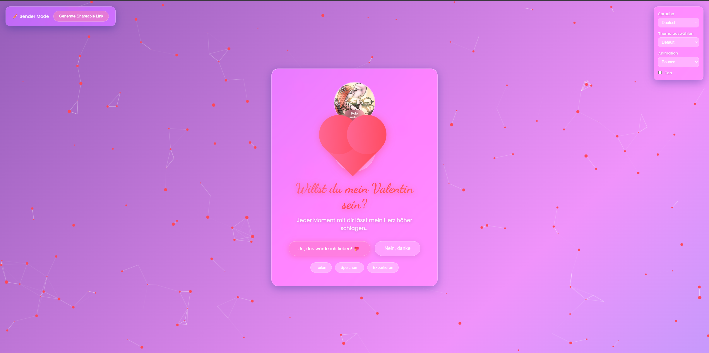
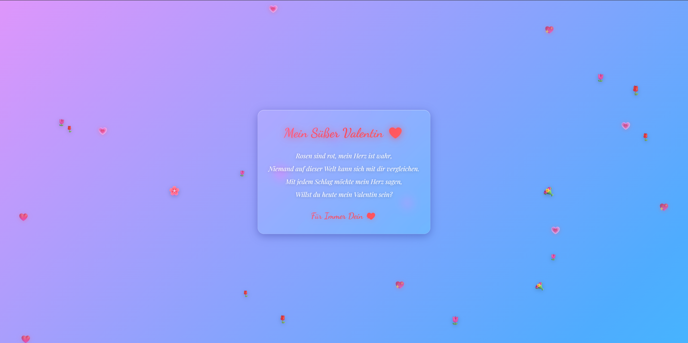

# JustBeMyValentine

[](LICENSE)
[](https://developer.mozilla.org/en-US/docs/Web/HTML)
[](https://developer.mozilla.org/en-US/docs/Web/CSS)
[](https://developer.mozilla.org/en-US/docs/Web/JavaScript)
[](https://voxhash.github.io/JustBeMyValentine/)
[](https://github.com/VoxHash/JustBeMyValentine/releases)

Interactive Valentine's Day proposal web app with glassmorphism UI, themes, multi-language support, sounds, photo personalization, and shareable recipient links.

**Live Demo:** https://voxhash.github.io/JustBeMyValentine/

## Features

- Glassmorphism proposal UI with animated heart and particle background
- Playful runaway "No" button and confetti celebration on "Yes"
- Romantic poem follow-up page (`poem.html`)
- Web Audio sound effects (toggleable)
- 8 languages: English, Spanish, French, German, Italian, Portuguese, Japanese, Chinese
- 7 themes and 6 animation presets
- Photo upload, local save, PNG export, social share actions
- Sender / recipient modes with tokenized share links (browser `localStorage`)

## Screenshots

### Main Proposal Page


### Exported Valentine Proposal Photo


### Romantic Poem Page


## Quick Start

```bash
git clone https://github.com/VoxHash/JustBeMyValentine.git
cd JustBeMyValentine
python3 -m http.server 8080
```

Open http://127.0.0.1:8080/

Or open `index.html` directly in a modern browser (a local server is recommended).

No build step, npm install, environment variables, or API keys are required.

## Installation

See [docs/installation.md](docs/installation.md).

### Browser requirements

- Chrome 76+, Firefox 103+, Safari 9+, Edge 79+
- CSS `backdrop-filter`, ES6, Flexbox/Grid
- Network access for CDN libraries (GSAP, particles.js, html2canvas, Google Fonts)

## Usage

1. Open the app in **sender** mode (default).
2. Choose language, theme, animation, and optional photo.
3. Click **Yes** to celebrate and open the poem page — or generate a shareable recipient link.
4. Recipients open `?token=...` (controls hidden). Settings load from the same browser origin's `localStorage`.

Full guide: [docs/usage.md](docs/usage.md)

## Configuration

| Component | Default | Where to change |
|-----------|---------|-----------------|
| Language | English (`en`) | Language selector / `localStorage` |
| Theme | Default | Theme selector / `themes.js` |
| Animation | Default | Animation selector |
| Sound | Enabled | Sound checkbox |
| Particle count | 50 | `script.js` |
| Glass blur | 20px | `style.css` |

Details: [docs/configuration.md](docs/configuration.md)

## Examples

- [Example 01 — Local personalized proposal](docs/examples/example-01.md)
- [Example 02 — Sender and recipient modes](docs/examples/example-02.md)

## Documentation

- [docs/index.md](docs/index.md)
- [CHANGELOG.md](CHANGELOG.md)
- [ROADMAP.md](ROADMAP.md)
- [CONTRIBUTING.md](CONTRIBUTING.md)
- [SECURITY.md](SECURITY.md)
- [SUPPORT.md](SUPPORT.md)

## Roadmap

Completed for v1.0.0: sounds, i18n, photo upload, themes, social share, save/export, animation presets.

Upcoming: cloud-backed share links, custom poem editor, accessibility pass, offline asset bundling. See [ROADMAP.md](ROADMAP.md).

## Contributing

See [CONTRIBUTING.md](CONTRIBUTING.md) and [CODE_OF_CONDUCT.md](CODE_OF_CONDUCT.md).

## License

MIT — see [LICENSE](LICENSE).

## Authors

**VoxHash Technologies**  
Contact: contact@voxhash.dev

## Acknowledgments

- [GSAP](https://greensock.com/gsap/)
- [particles.js](https://github.com/VincentGarreau/particles.js/)
- [html2canvas](https://html2canvas.hertzen.com/)
- [Google Fonts](https://fonts.google.com/)
- Web Audio API

## Support

Email contact@voxhash.dev or open a GitHub issue. See [SUPPORT.md](SUPPORT.md).
